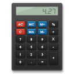

<p align="center">
  
</p>

# A Simple Calculator
An expo calculator app created with React Native.

# Libraries Used
* [React Native](https://github.com/facebook/react-native)
* [React Navigation](https://reactnavigation.org/)
* [React-Native-vector-icons](https://github.com/oblador/react-native-vector-icons)

# How to try this Application

1. Install expo Application from [AppStore](https://apps.apple.com/us/app/expo-go/id982107779) or [PlayStore](https://play.google.com/store/apps/details?id=host.exp.exponent&hl=en&gl=US) on your iOS/Android device.
2. Go to this link [https://expo.io/@soufianeodf/Calculator](https://expo.io/@soufianeodf/Calculator)
3. Scan the QR Code with your phone.

    

4. And then the application will automatically start.


# Getting Started
1. Fork (optional) and clone repo
```
 git clone https://github.com/soufianeodf/react-native-calculator.git

 cd react-native-calculator
```
2. Install dependencies
```
npm install
```
3. Run
```
expo start
```
